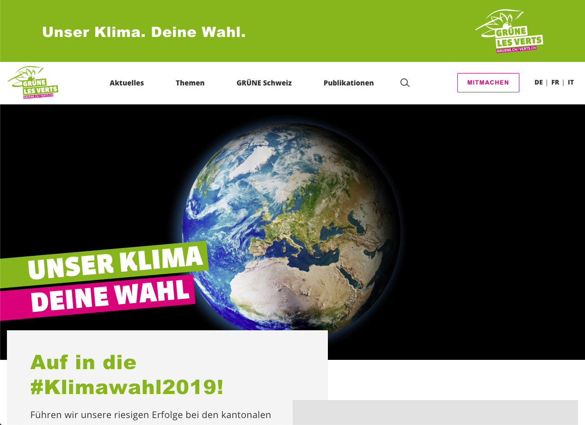
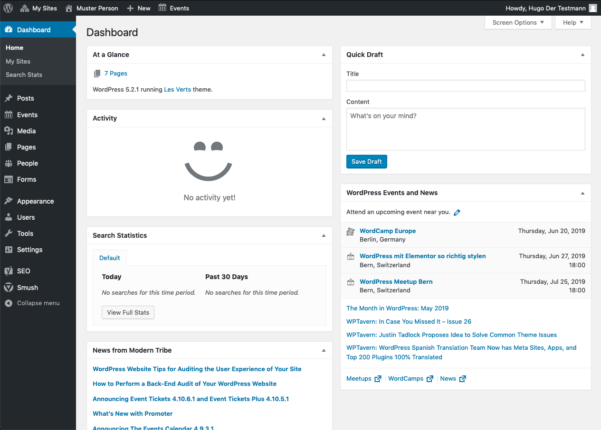
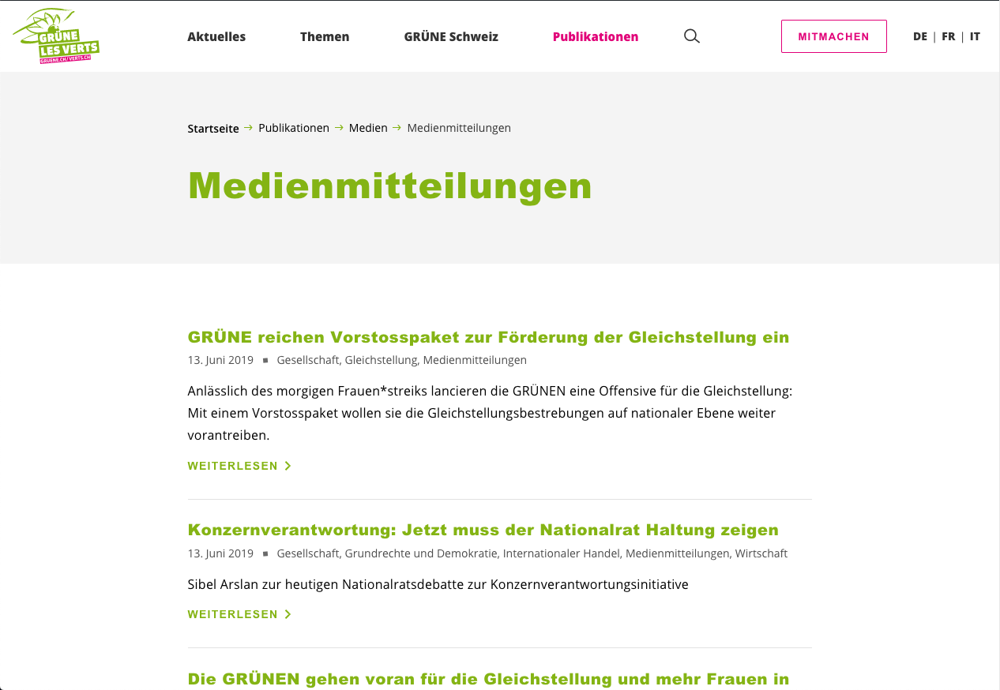

## Frontend
The actual website is referred to as the frontend. This is the part that we 
want to show the visitors and that can be reached via our web address. 
Example: [gruene.ch](https://gruene.ch)

## Backend
The backend is used to compose and change the content. That is, what is 
finally visible in the frontend. The backend can only be reached by login. To 
get to the backend, we call up the start page of our website and append 
`/wp-admin` to the URL. Example: 
[yourdomain.com/wp-admin](https://yourdomain.com/wp-admin)

## Content types
Content is presented to the user on either posts, pages, events or archives. 
It is a common difficulty to choose the right one. Therefore, it is important 
to know the following types.

## Pages
Pages contain content that is unique and timeless. A classic example is the 
contacts page. Unlike posts, pages are usually linked directly in the
menu.

## Posts
Posts are used for content that can be categorized. So e.g. news, suggestions
etc. but not for static contents like the page about me or the page contact. 
Posts appear in archives while pages don't. Posts are usually not linked 
directly in the menu, but they can be reached over the category of their 
archives. A post can be part of several archives.

## Archives
In the WordPress jargon, an archive refers to a collection of posts. The 
posts are automatically presented by the archive. You therefore can't add 
content directly to a archive.

## Events
Events are used to announce your happenings. The have a few special features 
like an time and a location where they take place. Once over the will be hidden 
from the default event archive, as soon as they are past.