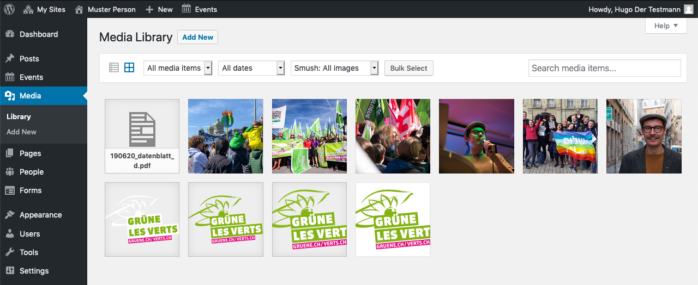
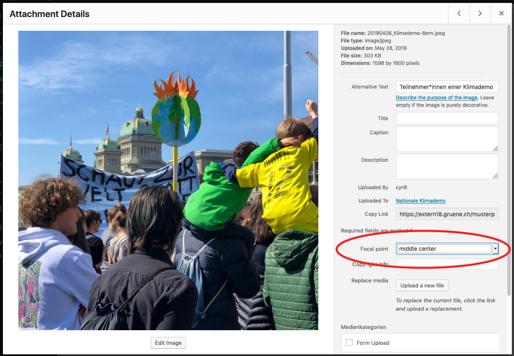
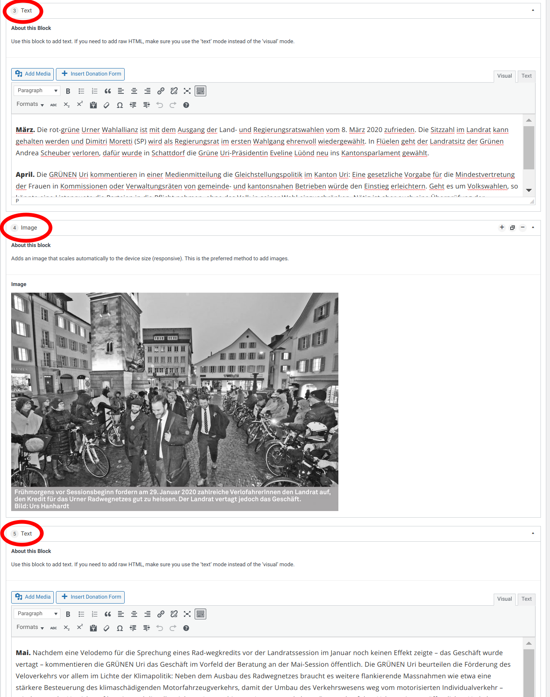

## Precondition

Make sure you
1. are [logged in](2-1-login.md).

## The Library

You can manage your assets like PDFs, images etc. in the media library. 
To upload new content, you may just drag it into the media library.

## Images

### Size

It's best practice to upload images in a **high resolution**. WordPress will 
automatically downscale the image and serve the correct size (depending on 
the visitors device and internet connection).

If you have the choice use images with a **landscape aspect ratio**, they work 
better with the different screen formats.

### File Format

For the web, it's best to use _.jpeg_ for photos and _.png_ for graphics and 
images with text in it.

### Focal Point

Because screens have different formats, you should set the focal point of 
your image. **This prevents wired cropping.** To set the focal point, change 
in to the edit screen by clicking the pen on the image (hover your mose over 
it). Just change the value in the corresponding dropdown and close the dialog
 box. It is saved automatically.

### Insert Images

If you wish the insert an image anywhere in your post or page, you are advised
to use an _Image_ [content block](2-2-front/#the-content-blocks). The content 
block image automatically adapts the image size to the viewer's screen width, 
regardless whether it's a mobile device or a large desktop monitor.

If you need to embed an image between two paragraphs of text, you may just
split the text into two text blocks, separated by an image block. Compared to
inserting the image directly into the text block, the text-image-text block 
setup brings major advantages when viewing the page on narrow screens.

