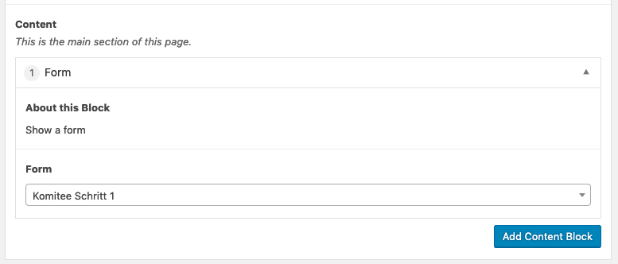
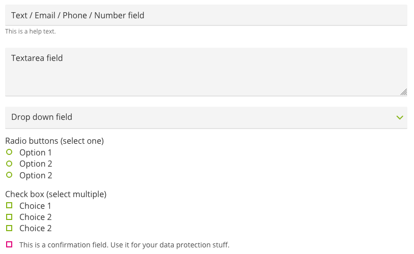
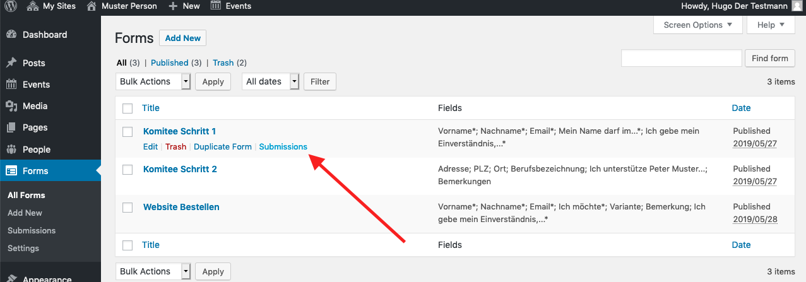

> The forms will be improved in the next months. Let us know, if there is 
something that doesn't work as expected or if you have an idea to improve 
something. 

## Precondition

Make sure you
1. are [logged in](2-1-login.md).
1. know how to [save changes](2-2-front.md#saving-changes).

## Editing or adding a form

> The most important thing with forms is testing. Once you created a form, 
test it! Always! Can you submit it? Did you receive the emails configured? Are 
the placeholders in the email correctly replaced?

To add or edit a form go to _forms_ then click _Add New_ or hover over the form 
you want to edit and click _Edit_. 

> To get started, it might be the easiest to make a copy of an existing form 
and play with it.

## Adding a form to a post or page

Forms are always part of a post or a page. If you want to have a form 
visible, you have to create a post or page and add it to this post or page.
To do so, use a _Form_ [content block](2-3-page.md#content-blocks) on the 
correspondig page or post and select the form that should be displayed.

## Form details

Add fields using the _Add field_ button 😉. You may **reorder** them by grabbing 
them on their number on the right hand side and dragging them on the position 
of desire.

### Form fields

Every input field of a form consists of a form field of a certain type. Here 
is how they look on the frontend:

The _Text_, _Email_, _Phone_ and _Number_ field are only distinguished by their 
accepted values. A text field will accept any value, an email field accepts 
only input that looks like a valid email address. So does the phone field for
phone numbers. The number field only accepts integers.

If you provide a help text, it is displayed below the corresponding field. 

### Submit

Use the **Button** field to define the text on the submit button. The 
**Button Submitting** field defines the text that is shown while submitting 
the form.

The **Description** field can be used to provide some additional info next to
the submit button.

### After Submit

You can simply show the visitor a message after he has submitted the form 
(_Show message (inline)_) or you can redirect him to a dedicated page 
(_redirect to post / page_).

## Mails

### Confirmation

Activate the confirmation to send the visitor an email, after he has 
completed a form.

> For this to work, the form must have exactly one field of type _email_.

You can use the _{{placeholders}}_ in the email template (body) and the subject 
field to personalise the email.

> Be aware, that the placeholder depend on the field label and therefore will
 change, if you change the field label. 

### Notification

You can specify an email address that will be notified for every form 
submitted. **Usually you may want to configure this.**

If you have a form that expects many submission, like a petition, you can 
also disable the notification. The submissions will always be available in 
the backend (see [submissions](#submissions)).

### Sender Settings

To reduce the probability your form submission emails will be marked as spam,
the sender address is fixed to website@_yourdomain.com_. However you can 
specify a nice name, that will be displayed to the user instead to the email 
address. 

For the receivers to be able to respond, you must add the _Reply-to_ 
email address. Usually this is your own email address.

## Submissions

All form submissions are stored on the website.

Note also the _Export .xlsx_ button on the bottom of the submissions page.