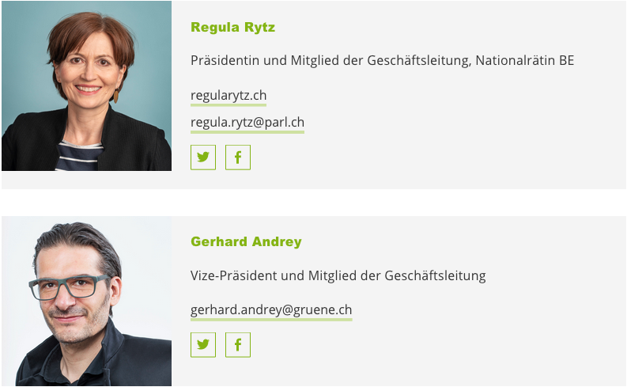
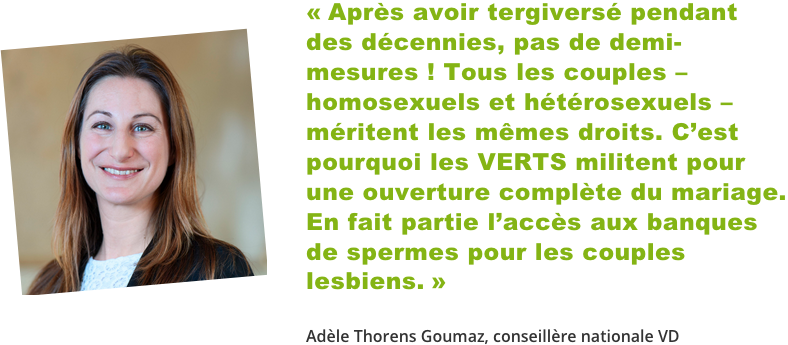

## Precondition
We assume you have already gathered some experience with your website and know
the basics terms, how to edit or add a post etc.

## General idea
Regardless if you want to show someones profile, a quote or a testimonial, 
you always have to add the person in the _People_ section first. This allows 
you to reuse the person on different places on your website, without having 
to care about the photo etc.

## Adding a person
* Go to _People_ > _Create_.
* The title serves as your internal identifier, it will never be displayed to
 the public.
* Ideally you add a square photo. If not, it is automatically cropped.
* Read more about testimonials in the [testimonials](#testimonials) section.

## Profiles
Using Profiles is a great way for a party website to present your bord 
members, your members of parliament and your candidates.

You may add them with only the minimal information (suits best for board 
members):

Or with in-dept information about the peron (suits best for candidates):

So to add a profile, add the person first. Then switch over to the page or 
post where you want to include the person and add a 
[content block](2-3-page.md#content-blocks) of type _Person_.

If you add some additional info, the person block in the frontend gets 
expandable, like in the second screenshot. Else it will be presented as in 
the first screenshot.

## Quotes
Quotes are especially nice in press releases.

To add a qoute, first add the person. Then switch over to the page or post where
you want to include the quote and add a 
[content block](2-3-page.md#content-blocks) of type _Quote_.

If you do this in a post in the [Press Release](2-4-post.md#template) template 
and you included the [Latest Press Release](2-2-front.md#latest-press-release) 
block on the front page, the quote will be displayed instead of the lead.

## Testimonials
Testimonials can be displayed on the [front page](2-2-front.md#testimonials) 
or on a regular page or post. However on pages and posts, they appear in a 
vertical alignment opposed to the front page, where they appear in a horizontal
carousel. The order of the testimonials is random for every pageload. 

Since we may want to show the testimonials on multiple places on the website,
 the quote is added directly to the person, so we don't have to repeat it 
 everywhere we insert the testimonials content block. Assign a category to 
 every testimonial (one person can have multiple testimonials, for example 
 for different campaigns). You can then select the testimonials to display by
 category (in the content block).